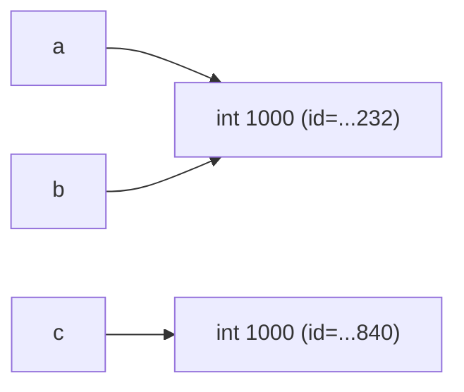

# Лабораторная работа № 1

**Выполнение программы, объекты и базовые типы Python**

- Python: 3.11 (или новее; версия фиксируется по выводу `python --version`)
- ОС: Windows
- Все файлы запускаются командой `python task_N.py` без изменений.

---

## Задание 1. От исходного кода к байткоду

### Часть 1. Режимы запуска

**REPL.** В интерактивной оболочке выражение `2 + 3 * 4` вводится построчно; интерпретатор разбирает его, вычисляет и **немедленно печатает** результат (`14`). REPL — это цикл «прочитал — вычислил — напечатал», и печать результата — часть его поведения по умолчанию.

**Файл.** При запуске `python task_1.py` интерпретатор читает файл целиком, компилирует его в байткод и выполняет. Строка `2 + 3 * 4` является **инструкцией-выражением**: значение вычисляется и сразу отбрасывается — печатать его некому. Чтобы результат появился в терминале, выражение нужно передать в `print()`.

Изменённый файл: см. `task_1.py`, где есть и «голая» строка `2 + 3 * 4`, и `print(2 + 3 * 4)`.

### Часть 2. Выражения и инструкции

```python
course = "Python"
hours = 4 * 2
print(f"{course}: {hours} часов")
```

**Выражения:**
- `"Python"` — строковый литерал;
- `4 * 2` — арифметическое выражение;
- `f"{course}: {hours} часов"` — f-строка как выражение;
- `print(...)` — вызов функции (выражение, возвращающее `None`).

**Инструкции (statement):**
- `course = "Python"` — присваивание;
- `hours = 4 * 2` — присваивание;
- `print(f"...")` — инструкция-выражение (результат отбрасывается).

**Литералы:** `"Python"`, `4`, `2`, а также строковые фрагменты внутри f-строки (`": "`, `" часов"`).

**Имена, создаваемые при выполнении:** `course`, `hours` (привязываются к объектам в момент присваивания). Имя `print` уже существует — оно приходит из встроенного пространства имён.

### Часть 3. AST и байткод

Команды:

```
python --version
python -m ast task_1.py
python -m dis task_1.py
```

**Версия интерпретатора:** `Python 3.11.x` (укажите точную версию из вывода).

**Фрагмент AST** (структура узлов для строки `hours = 4 * 2`):

```
Assign(
    targets=[Name(id='hours', ctx=Store())],
    value=BinOp(
        left=Constant(value=4),
        op=Mult(),
        right=Constant(value=2)))
```

- `Assign` — узел присваивания;
- `BinOp` с `op=Mult()` — арифметическая операция умножения;
- для `print(...)` — узел `Expr(value=Call(func=Name(id='print'), args=[...]))`.

**Фрагмент байткода** (для `print(f"{course}: {hours} часов")`, вывод `dis`):

```
LOAD_NAME        course
LOAD_NAME        hours
FORMAT_VALUE
...
LOAD_NAME        print
CALL
POP_TOP
```

- `LOAD_NAME` / `LOAD_CONST` — загрузка имени или константы в стек;
- `CALL` — вызов функции;
- `POP_TOP` — отбрасывание результата.

Названия и состав инструкций меняются между версиями CPython, поэтому важно не запомнить конкретный набор, а увидеть общую модель: **выражение → дерево → линейная последовательность операций над стеком**.

### Контрольный вопрос

**Почему байткод CPython нельзя считать машинным кодом процессора?**

Машинный код — это инструкции, которые понимает конкретный процессор (x86-64, ARM и т. д.). Байткод CPython — это инструкции **виртуальной машины CPython**, исполняемые интерпретатором. Один и тот же `.pyc` не заработает без CPython; чтобы стать машинным кодом, байткод должен быть дополнительно интерпретирован или скомпилирован (например, через Cython, Nuitka, PyPy JIT). Кроме того, байткод привязан к версии CPython: `.pyc` от 3.11 не совместим с 3.12.

---

## Задание 2. Имена, объекты и сравнение

### Прогноз (до запуска)

| Сравнение | Прогноз |
|---|---|
| `a == b` | `True` |
| `a is b` | `True` |
| `a == c` | `True` |
| `a is c` | `False` |

### Фактический результат

```
Типы: <class 'int'> <class 'int'> <class 'int'>
Идентификаторы: 2450559121232 2450559121232 2450559121840
a == b: True
a is b: True
a == c: True
a is c: False
```

`id(a)` и `id(b)` совпадают (одно и то же число), `id(c)` отличается. Совпадает с прогнозом.

### Схема имён и объектов



`a` и `b` — **два имени одного объекта**. `c` — имя другого объекта с тем же значением.

### Равенство vs идентичность

- `==` сравнивает **значения** (`__eq__`).
- `is` сравнивает **идентичность объектов** (тот же объект в памяти, тот же `id`).

`b = a` не создаёт новый объект. `int("1000")` создаёт **новый объект** с тем же числом — поэтому `a == c`, но `a is not c`.

### Проверка c на None

```python
c = None
print("c is None:", c is None)   # True
```

`None` — синглтон. Правильно писать `c is None`, а не `c == None`.

### Фрагмент со строками

```
True
True
```

`first is second` даёт `True`, потому что CPython **интернирует** строковые литералы, состоящие из латиницы и цифр. Однако это деталь реализации: полагаться на неё в логике нельзя. Если бы строка формировалась, например, так: `"".join(["py", "thon"])` — интернирование могло бы не сработать.

### Правило: `==` vs `is`

- `is` — когда важно, что это **тот же самый объект**: `None`, `True`, `False`, sentinel-объекты.
- `==` — когда важно **значение**: числа, строки, пользовательские объекты с осмысленным `__eq__`.

### Контрольные вопросы

1. **Создаёт ли `b = a` копию объекта?** Нет. Присваивание лишь связывает имя `b` с тем же объектом, что и `a`. Копию нужно создавать явно (`copy.copy`, `copy.deepcopy`).
2. **Что возвращают `type()` и `id()`?** `type()` — объект-класс (сам класс как объект); `id()` — целое число, идентификатор объекта, обычно адрес в памяти на CPython.
3. **Почему `None` сравнивают через `is`, а числа и строки — через `==`?** `None` — синглтон, его идентичность всегда однозначна, и `is` не может быть перегружен. Числа и строки сравниваются по значению; `is` для них зависит от кеширования и интернирования — ненадёжен.

---

## Задание 3. Числовые типы

### Эксперимент A

| Операция | Результат | Тип |
|---|---|---|
| `x + y` | `22` | `int` |
| `x - y` | `12` | `int` |
| `x * y` | `85` | `int` |
| `x / y` | `3.4` | `float` |
| `x // y` | `3` | `int` |
| `x % y` | `2` | `int` |
| `x ** y` | `1419857` | `int` |

`/` — **истинное** деление, всегда возвращает `float`. `//` — **целочисленное** деление, возвращает тип, зависящий от операндов: для `int // int` — `int`, для `float // float` — `float`.

### Эксперимент B

`2 ** 1000` — целое из 302 цифр. Python использует **произвольную точность** (big integers, `long` в Python 2, `int` в Python 3). В C/C++/Java `int` ограничен 32/64 битами; переполнение молча даёт мусор или требует отдельного типа `BigInteger`.

### Эксперимент C

```
result = 0.30000000000000004
result == 0.3: False
result - 0.3 : 5.551115123125783e-17
math.isclose(result, 0.3): True
```

`0.1`, `0.2` и `0.3` в двоичной системе с плавающей точкой не представимы точно. Их сумма накапливает ошибку порядка 1e-17. **Правило:** числа с плавающей точкой сравнивать через `math.isclose(a, b)` (или `abs(a-b) < eps`).

### Эксперимент D

| Выражение | Результат | Тип |
|---|---|---|
| `int("42")` | `42` | `int` |
| `float("3.14")` | `3.14` | `float` |
| `str(2026)` | `'2026'` | `str` |
| `bool(0)` | `False` | `bool` |
| `bool(-1)` | `True` | `bool` |
| `bool("")` | `False` | `bool` |
| `bool("False")` | `True` | `bool` |
| `complex(2, -3)` | `(2-3j)` | `complex` |

`bool("False")` — `True`, потому что **непустая строка** истинна. Значение строки (`"False"`) не интерпретируется как логическое; важно только, что длина > 0. `complex.real = 2.0`, `complex.imag = -3.0`.

### Контрольные вопросы

1. **Почему `int / int` даёт `float`?** Потому что результат может быть дробным, и Python не хочет терять точность. Для целочисленного деления есть `//`.
2. **Чем `int("42")` отличается от `int(42.9)`?** `int("42")` разбирает строку, требует корректного целочисленного литерала. `int(42.9)` усекает вещественное число до `42` (округление к нулю), не округляет.
3. **Falsy из D:** `bool(0)` и `bool("")`. Также ложными были бы `0.0`, `None`, пустые коллекции.

---

## Задание 4. Строки, Unicode, форматирование

### Результаты

```
Первый символ: А
Последний символ: а
Имя: Анна
Фамилия: Смирнова
ВЕРХНИЙ: АННА СМИРНОВА
нижний: анна смирнова
Инициалы: А.С.
Курс наоборот: nohtyP ан еинавориммаргорп ивонсО
Анна Смирнова — Основы программирования на Python: 7/10 (70.0%)
Анна Смирнова — Основы программирования на Python: 7/10 (70.0%)
Анна Смирнова — Основы программирования на Python: 7/10 (70.0%)
```

### Unicode

```
symbol = "Я"
ord("Я") = 1071
chr(1071) = "Я"
"Я".encode("utf-8") = b'\xd0\xaf'
len("Я") = 1
len(b'\xd0\xaf') = 2
```

`len(symbol) == 1` — считаются **кодовые точки**. `len(encoded) == 2` — в UTF-8 кириллица занимает 2 байта.

### Ошибка присваивания по индексу

```python
# symbol[0] = "я"
# TypeError: 'str' object does not support item assignment
```

Строки **неизменяемы**. Методы `.upper()`, `.replace()` возвращают **новую** строку, старая не меняется. В этом и состоит разница между «неизменяемым объектом» и «операцией, возвращающей новый объект».

### Контрольные вопросы

1. **Почему `len(symbol)` и `len(symbol.encode("utf-8"))` различаются?** Первое — число кодовых точек (символов), второе — число **байтов** в UTF-8. Для кириллицы и большинства не-ASCII символов это разные величины.
2. **Что означают границы и шаг в `text[start:stop:step]`?** `start` — с какого индекса включительно; `stop` — до какого **не включая**; `step` — шаг (может быть отрицательным для обратного порядка). Отрицательные индексы считаются с конца. Пропущенный `start` = 0, `stop` = конец, `step` = 1.
3. **Почему строка неизменяема, хотя `.upper()` возвращает «изменённый» текст?** Метод не изменяет исходную строку — он **создаёт новую**. Старая остаётся прежней. Это позволяет безопасно использовать строки как ключи словаря и передавать между потоками без блокировок.

---

## Задание 5. Информационная карточка

### Пример запуска

```
Имя исследователя: Анна Смирнова
Название эксперимента: Проверка модели
Количество запусков: 8
Длительность одного запуска, с: 12.5
Действительная часть коэффициента: 2
Мнимая часть коэффициента: -3

========================================
ЭКСПЕРИМЕНТ: Проверка модели
Исследователь: Анна Смирнова
Запуски: 8
Общее время: 100.00 с (1.67 мин)
Коэффициент: (2-3j)
Квадрат модуля: 13.00
Есть выполненные запуски: True
========================================
Типы введённых значений:
  name       -> <class 'str'>
  experiment -> <class 'str'>
  runs       -> <class 'int'>
  duration   -> <class 'float'>
  real_part  -> <class 'float'>
  imag_part  -> <class 'float'>
```

### Типы имён после выполнения

| Имя | Тип объекта |
|---|---|
| `name` | `str` |
| `experiment` | `str` |
| `runs` | `int` |
| `duration` | `float` |
| `real_part` | `float` |
| `imag_part` | `float` |
| `total_seconds` | `float` |
| `total_minutes` | `float` |
| `coeff` | `complex` |
| `mod_sq` | `float` |
| `has_runs` | `bool` |

### Разбор одной арифметической строки

```python
total_seconds = runs * duration
```

- литералов нет;
- имена: `total_seconds`, `runs`, `duration`;
- операторы: `=` (присваивание), `*` (умножение);
- вызовов функций нет.

В AST это `Assign(targets=[Name], value=BinOp(left=Name, op=Mult, right=Name))`.

### Путь программы

1. **Исходный файл** `task_5.py` читается интерпретатором.
2. **Разбор** — токенизация и построение **AST** (абстрактного синтаксического дерева).
3. **Компиляция** — AST превращается в **байткод** (объект `code`).
4. **Выполнение** — виртуальная машина CPython исполняет байткод; байткод привязан к **frame** функции/модуля, который хранит локальные имена.
5. `input()` возвращает строку из stdin; `int()`/`float()` создают новые объекты числовых типов.

### Почему `input()` нужно преобразовывать

`input()` **всегда возвращает `str`**, даже если пользователь ввёл `42`. Умножение `"8" * 12.5` — ошибка (`TypeError`), а `"8" * 2` дало бы `"88"` (повтор строки). Поэтому перед арифметикой вызываем `int(...)` или `float(...)`.

### Контрольный вопрос

**Что изменится на уровне объектов и связывания имён при повторном присваивании?**

При `x = 5; x = 7`:
- создаётся новый объект `int 7`;
- имя `x` **перепривязывается** к нему;
- старый объект `int 5` остаётся в памяти, пока на него есть ссылки;
- когда ссылок нет, сработает сборщик мусора (или освобождение по подсчёту ссылок).

Имя — это **метка**, объект — **значение в куче**. Присваивание меняет только метку.

---

## Итоговый вывод

Три наиболее неожиданных особенности Python:

1. **Присваивание не копирует объект.** `b = a` создаёт второе имя для того же объекта. Изменяемые объекты через два имени видны обоим — источник классической ошибки с `list`.
2. **`is` и `==` — разные вещи, и путать их опасно.** Работает в большинстве случаев, но интернирование и кеширование делают поведение зависимым от деталей реализации.
3. **Числа с плавающей точкой нельзя сравнивать через `==`.** `0.1 + 0.2 != 0.3`; требуется `math.isclose`. Аналогично целые Python — произвольной точности, что резко отличает их от C/C++.
